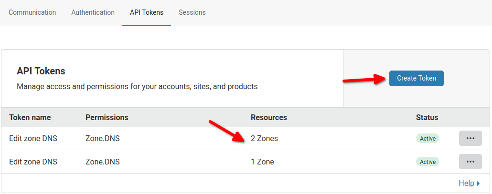
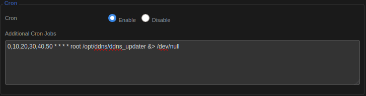
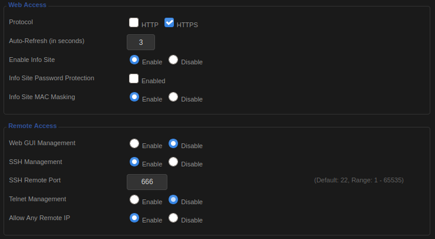
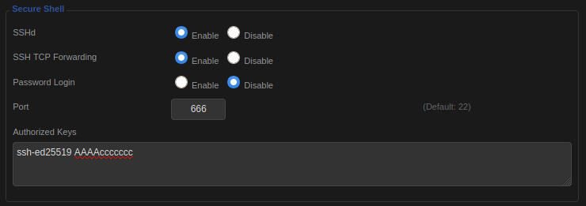
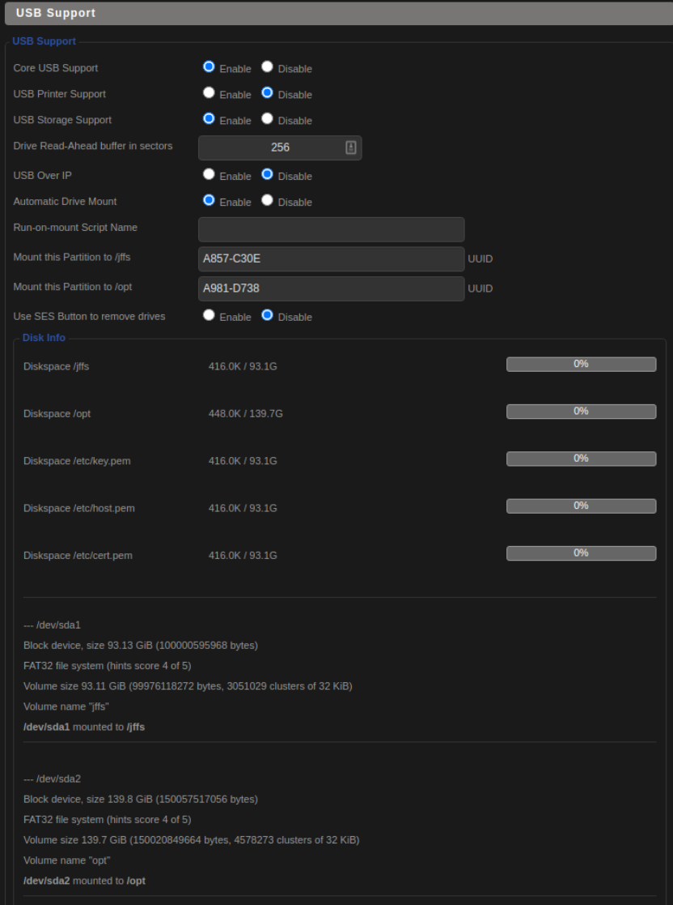
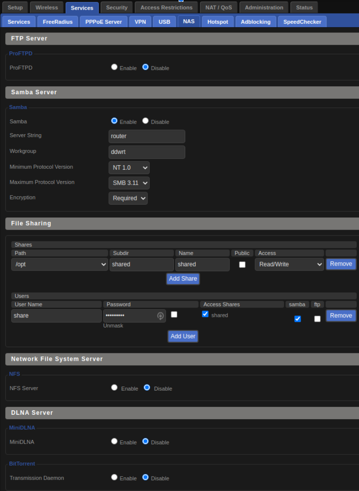

# [ddwrt](https://dd-wrt.com/)

[ddwrt](https://dd-wrt.com/) how-to and scripts. Learn to configure ddwrt to get the best out of your router.
We cover a lot from

## Table of Contents

1. [DynDns without any third party software](#DynDNS-without-any-third-party-software)
2. [SSH connection and overall security](#SSH-connection-and-overall-security)
3. [Cronjob](#Cronjob)
4. [USB Support](#USB-Support)
5. [DNS Masq](#DNS-Masq)
6. [HTTPS](#HTTPS)
7. [Logging](#Logging)
8. [Wireguard VPN Server](#Wireguard-VPN-Server)
9. [Guest Network](#Guest-Network)
10. [Usefull Commands](#Usefull-Commands)

## DynDns without any third party software

To follow these steps you will need a [SSH connection](#SSH-connection-and-overall-security) to your router and [USB Support](#USB-Support) to be able to write the needed files.  
You don't want to use an external provider to take care of your dyndns. Indeed all you need is a good old script.
We can make use of the cloudflare API and the DDWRT cron job to check on interval if our WAN IP is still the same as the one in our A DNS record.

1. Copy the [DNS updater script](./dyndns/ddns_updater) to your router

```
$scp -P 666 ddns_updater  root@10.10.1.1:/opt/ddns/ddns_updater
```

2. Copy the [Certificate Authority Bundle](./dyndns/cacert.pem) to your router

```
$scp -P 666 cacert.pem  root@10.10.1.1:/opt/ddns/cacert.pem
```

3. Adapt the [DNS updater script](./dyndns/ddns_updater).

   1. Log into cloudflare to generate an API Token. Make sure the token let you edit zone of your domain. Fill it in the `CLOUDFLARE_BEARER_TOKEN` variable
      

   2. Modify the `DDNS_DOMAIN_OBJECTS` variable to suit your need
   3. Modify the `LOG_FILE`, `CURL_LOG_FILE`
      `CURL_LOCATION`,
      `CA_BUNDLE` variables if needed

4. launch the script with a [cronjob](#cronjob) in `Administration -> Management`.
   . On this example the script runs every 10 minutes. Check the [cronjob](#cronjob) section to troubleshoot.

## SSH connection and overall security

Let's make your router accessible from the outside world aka the world wide web. Note that it is most handy if you have a [domain name that is redirected to our router's IP](#DynDNS-without-any-third-party-software).

Inside `Administration -> Management` a good practice is to

- enable https only to avoid leaking your password on your network
- disable Web GUI management as it is more secure to only allow SSH from the outside world.
- change the default SSH remote port so that it will require more time for an attacker to identify the port.
- in `Services -> Services` Enable SSHd and disable Password Login only allow access via SSH to known publickeys (Authorized Keys)

It should pretty much look like this




Now you should be able to login to your router through SSH from the outside !

### SSH TCP Forwarding

It can be interesting to enable [SSH TCP Forwarding](https://forum.dd-wrt.com/wiki/index.php/Telnet/SSH_and_the_Command_Line#SSH_Port_Forwarding). For instance if you want to access a LAN-accessible service without port forwarding. You can instead through your SSH connection forward that port to your local using this command.

```
# assumptions:
# your router wan ip is 12.23.34.45
# SSHd is runing on port 9999
# a lan server on your local network at ip 192.168.1.42 expose a service on port 443

$ ssh -L 8087:192.168.1.42:443 root@12.23.34.45 -p 9999
```

`192.168.1.42` is running a service on port `443` that is now accessible to your host on port `8087`. Note that there is no need for a port forwarding defined in `NAT-QoS -> Port forwarding` for this to work. It will work as long as your ssh connection is up.

## Cronjob

go to `Administration -> Management` screen
and enable cron.


Here are some things to know about cron

cron don’t like `.sh` at the end

cron didn't like `0/10 * * * ` write it this way instead `0,10,20,30,40,50 * * *`

At the end of the cron job be sure to leave an empty line e.g

```
0,10,20,30,40,50 * * * * root /opt/ddns/ddns_updater &> /dev/null

```

## USB Support

Why? Well The default DD-WRT file system is read-only, expect for nvram parameters and the available memory in /tmp. So if you want to add some script or to store logs you gotta need some extra space.

The information in the [wiki](https://wiki.dd-wrt.com/wiki/index.php/USB_storage) can be outdated.
Here is what worked for me. Simply connect an USB drive to your router and enable inside `Services -> USB`
`Core USB Support`, `USB Storage Support` and `Automatic Drive Mount`. You should see on the bottom of the page information about your USB drive look for the `UUID` that is what you need to mount the drive to `/jffs` or `/opt`



Note that the UUID are the partition labels that must be on the usb drive and that will be mounted to `/jffs` and `/opt`

### NAS

You can use these USB drive to act like a NAS. It will be quite fast as it directly accessible to the router.
Here is how I securely share the folder `/opt/shared` through a samba server.



## DNS Masq

## HTTPS

## Logging

Enable syslog
Add startup script to log into usb flash
https://192.168.1.1/Syslog.asp

https://wiki.dd-wrt.com/wiki/index.php/Logging_with_DD-WRT

killall syslogd
syslogd -L -s 8192 -O /opt/var/log/messages

Log center synology

## Wireguard VPN Server

## Guest Network

## usefull commands

`DD-WRT` v3.0 runs [`BusyBox`](https://busybox.net/downloads/BusyBox.html). When you login through ssh you will end up on the built-in shell (ash) wich is similar to `sh` but not to `bash`.

let's see if the httpd process is running

```
$ ps | grep httpd
```

What TCP/UDP port are open and which process is using them ?

```
$ netstat -tulpn
```

restart cron

```
$stopservice cron && startservice cron
```

### nvram

A router take advantage of a NVRAM (non-volatile RAM) which is a persistent memory fast but not huge. It stores DD-WRT settings that you normally change using Web Interface and settings for user Startup Scripts.

That's why if we want to store things we should rather connect an usb drive.

to list the whole nvram

```
$ nvram show
```

to set and get variable (beware not to overwrite some variables ...)

```
$ nvram get <variable_name>
$ nvram set <variable_name>="<value>"
```

Save all changed variables to NVRAM

```
$ nvram commit
```

### services

restart the gui (httpd)

```
stopservice httpd
startservice httpd
```

restart the ssh deamon

```
stopservice sshd
startservice sshd
```

### logs

deamon httpd crond sshd
logs

find more information in the [wiki](https://wiki.dd-wrt.com/wiki/index.php/Telnet/SSH_and_the_Command_Line#The_DD-WRT_Command_Line)
